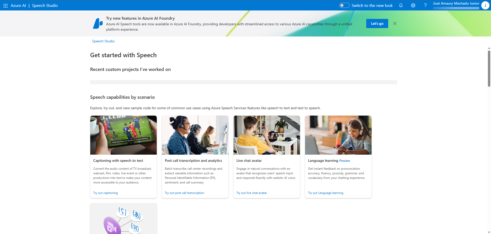
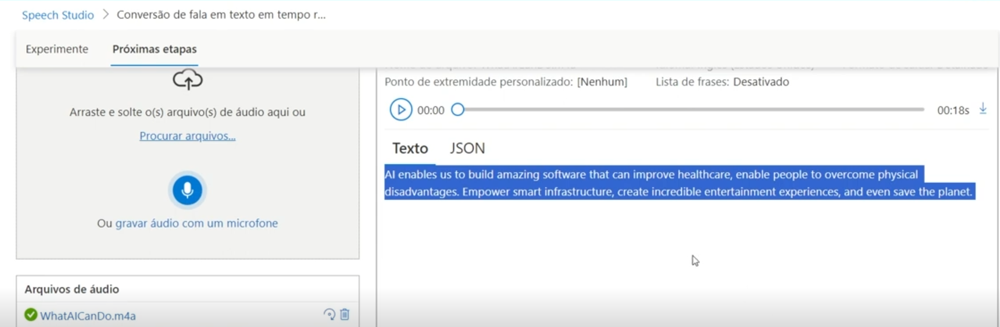
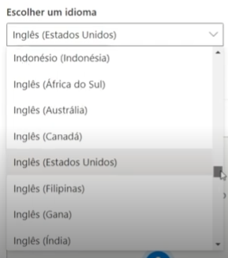
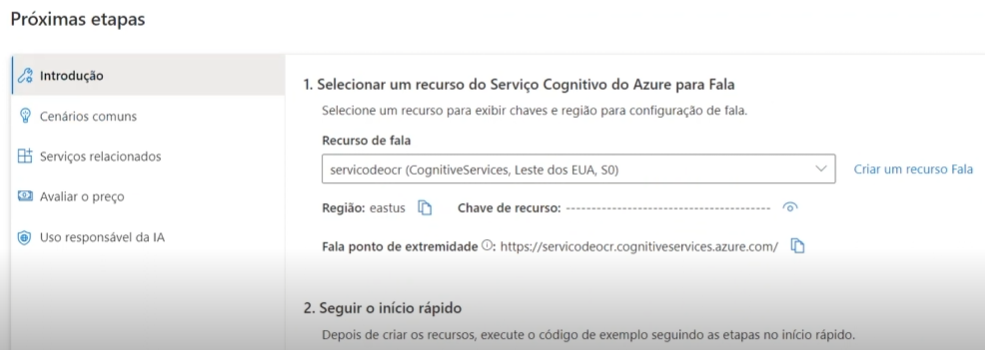

# Azure Speech & Language Studio Lab

## Objetivo
Descrever o propósito do laboratório e os conceitos de Speech e Language AI aplicados.

## Pré-requisitos
- Conta Azure com assinatura ativa
- Speech Studio e Language Studio disponíveis
- GitHub configurado

## Passo a passo
1. Criar recurso Speech Service no Azure
2. Testar análise de fala (Speech Studio)
3. Testar análise de linguagem natural (Language Studio)
4. Capturar resultados relevantes

## Pagina de login do microsoft speech studio

## Upload de um audio em ingles onde o microsoft speech studio me retornou a transcricao perfeita do que foi falado.

## Nele possui a possibilidade de enviar qualquer arquivo de audio ou texto em diferentes idiomas que ele ira transcrever/traduzir

## Apos isso basta configurar o azure fala, selecionar planos e valores e aproveitar a ferramenta

## Referências
- [Speech Studio Documentation](link)
- [Language Studio Documentation](link)
- [GitHub Markdown Guide](link)
